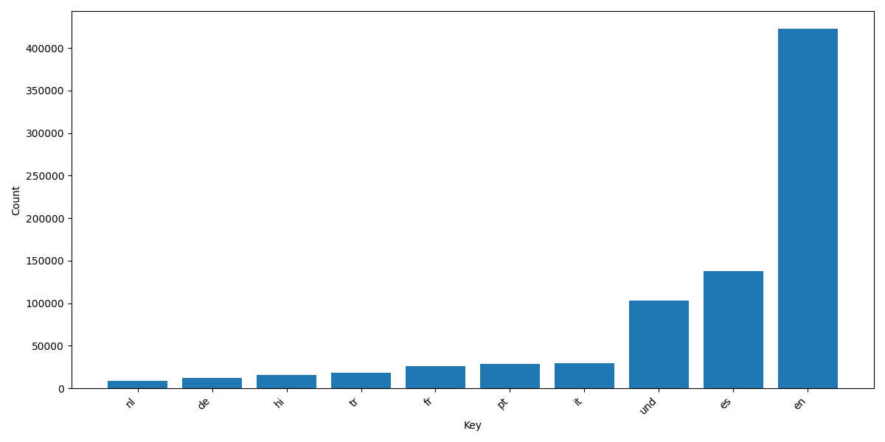
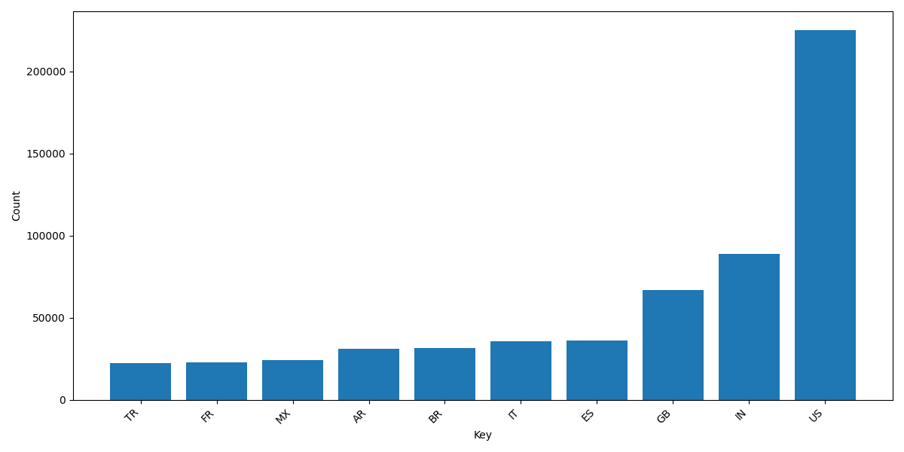
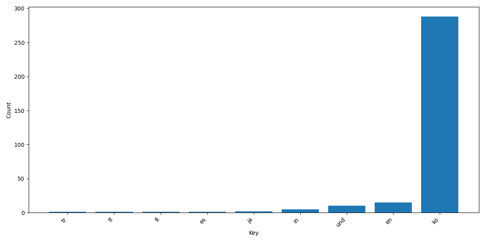
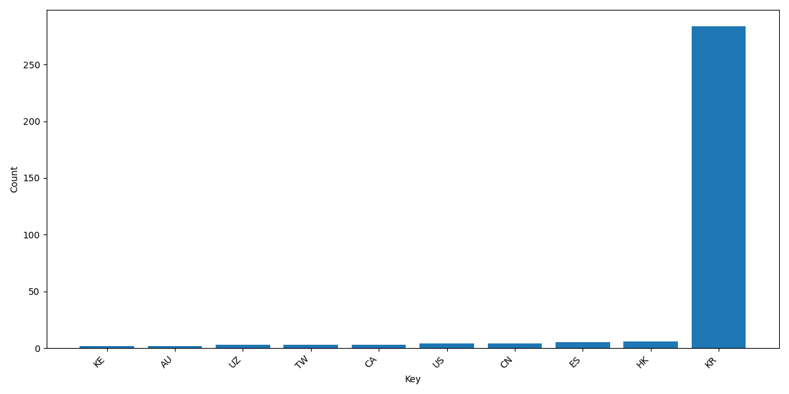
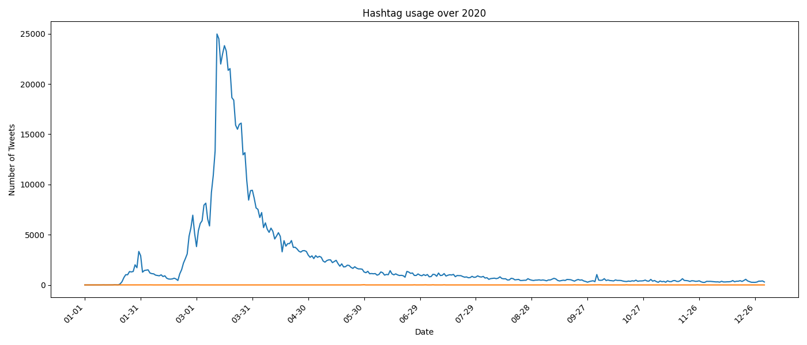

# Coronavirus Twitter Analysis

## Overview
This project analyzes approximately 1.1 billion geotagged tweets from 2020 to track the spread of coronavirus-related hashtags across languages and countries. It uses the MapReduce paradigm to process the data in parallel, with each day's tweets mapped independently and then reduced into a single output.

## Process
1. **Map**: `src/map.py` processes each day's tweet file, counting hashtag usage by language and country.
2. **Reduce**: `src/reduce.py` combines all the mapped outputs into a single file for language and country respectively.
3. **Visualize**: `src/visualize.py` generates bar charts of the top 10 languages/countries for a given hashtag.
4. **Alternative Reduce**: `src/alternative_reduce.py` generates a line plot showing hashtag usage over the course of 2020.

## Results

### #coronavirus by Language

### #coronavirus by Country

### #코로나바이러스 by Language

### #코로나바이러스 by Country

### Hashtag Usage Over Time

